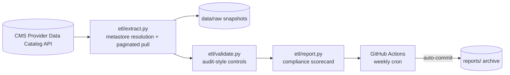

# CMS Provider Data Compliance Pipeline


An automated, audit-style monitoring pipeline for publicly reported CMS provider-quality data. On a weekly schedule it pulls the latest hospital and nursing home quality datasets directly from the CMS Provider Data Catalog API, runs a battery of data-compliance controls modeled on healthcare data-availability audit practice (completeness, uniqueness, timeliness, validity, referential integrity), and publishes a versioned compliance scorecard to this repository.

Built as a portfolio demonstration of production ETL design, data governance controls, CI/CD automation, and audit-ready documentation.

## How it works



1. **Resolve** — the pipeline reads the CMS metastore at runtime and matches datasets by title keywords, so it survives catalog re-issues and identifier changes.
2. **Extract** — each dataset is paginated from the datastore query API into a CSV snapshot under `data/raw/` (gitignored; re-downloaded every run so the repository stays lean).
3. **Validate** — audit controls are executed per dataset (see controls table below).
4. **Report** — `reports/compliance_report.md` is regenerated and an immutable copy is archived under `reports/archive/` on every run, creating a longitudinal audit trail.
5. **Automate** — a scheduled GitHub Actions workflow runs the pipeline weekly (Mondays 09:00 UTC) and commits the results automatically.

## Datasets monitored

| Dataset | Domain | Source |
| --- | --- | --- |
| Hospital General Information | Facility master | CMS Provider Data Catalog |
| Timely and Effective Care — Hospital | Process quality | CMS Provider Data Catalog |
| Readmissions, Complications and Deaths — Hospital | Outcome quality | CMS Provider Data Catalog |
| Unplanned Hospital Visits — Hospital | Outcome quality | CMS Provider Data Catalog |
| Healthcare Associated Infections — Hospital | Patient safety | CMS Provider Data Catalog |
| Patient Survey (HCAHPS) — Hospital | Patient experience | CMS Provider Data Catalog |
| Nursing Home Provider Information | Long-term care | CMS Provider Data Catalog |

## Compliance controls

| Control | What it verifies | Failure condition |
| --- | --- | --- |
| Availability | Dataset extracted with rows > 0 | Extraction error or zero rows |
| Freshness | Days since CMS last published the dataset | > 190 days (warn > 95) |
| Conformity | Required columns present in schema | Any required column missing |
| Completeness | Share of populated values in required fields | > 5% missing (warn > 0.5%) |
| Uniqueness | Duplicate facility/measure key rate | > 1% duplicate keys |
| Validity | Values within plausible ranges (ratings 1–5, scores 0–100) | < 95% in range |
| Referential integrity | Measure-file facility IDs exist in the facility master | < 98% matched |

Thresholds are centralized in `etl/config.py` so an auditor can review control limits without reading the validation logic.

## Quickstart

```bash
pip install -r requirements.txt
python -m etl.run_pipeline
open reports/compliance_report.md
```

Or trigger a run on demand from the **Actions** tab (CMS Compliance Pipeline → Run workflow).

## Sample output

The generated scorecard includes an executive summary, a dataset × control matrix, per-check detail, and full data provenance (CMS titles, last-modified dates, source links, run timestamp, and commit SHA). See [`reports/compliance_report.md`](reports/compliance_report.md) for the latest run.

## Design decisions

- **No PHI risk** — the pipeline uses only public aggregate reporting data from data.cms.gov; no beneficiary-level or claims data containing protected health information is processed.
- **Fail-soft extraction** — a failure in one dataset is recorded as an availability failure and never blocks the others.
- **Machine + human outputs** — `reports/run_metadata.json` supports downstream dashboarding; the Markdown scorecard is written for human reviewers.
- **Audit trail** — every run is archived immutably under `reports/archive/`, keyed by timestamp.

## Portfolio case study

For a deeper walkthrough of the problem, approach, audit-control mapping, and skills demonstrated, see [docs/case-study.md](docs/case-study.md).

## Data use

All data originates from the [CMS Provider Data Catalog](https://data.cms.gov/provider-data/) and is subject to CMS public information posting terms. This repository is not affiliated with or endorsed by CMS.
